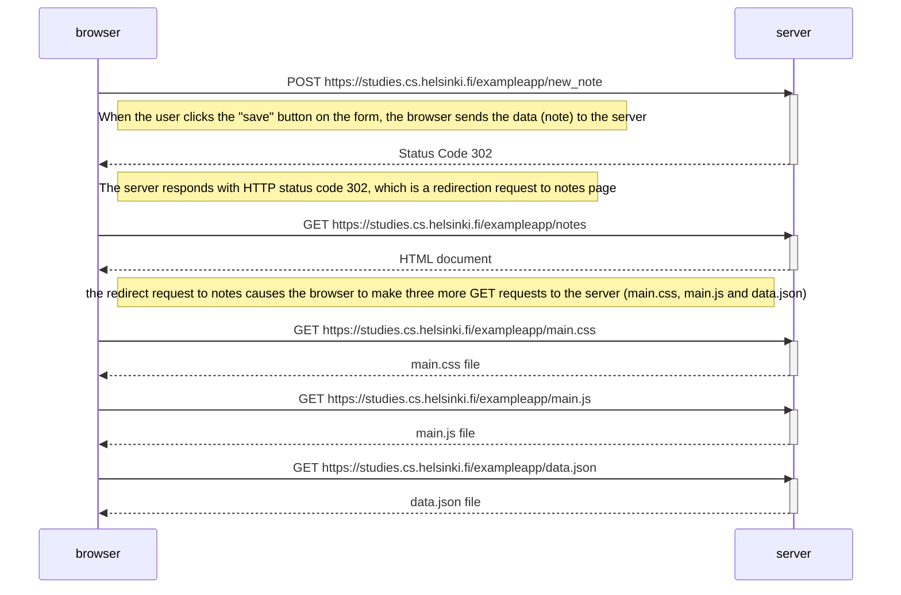

# 0.4: uusi muistiinpano

```mermaid
sequenceDiagram

    participant browser
    participant server

    browser->>server: POST https://studies.cs.helsinki.fi/exampleapp/new_note
    activate server

    Note right of browser: When the user clicks the "save" button on the form, the browser sends the data (note) to the server

    server-->>browser: Status Code 302
    deactivate server

    Note right of browser: The server responds with HTTP status code 302, which is a redirection request to notes page
    
    browser->>server: GET https://studies.cs.helsinki.fi/exampleapp/notes
    activate server

    server-->>browser: HTML document
    deactivate server

    Note right of browser: the redirect request to notes causes the browser to make three more GET requests to the server (main.css, main.js and data.json)
    
    browser->>server: GET https://studies.cs.helsinki.fi/exampleapp/main.css
    activate server
    server-->>browser: main.css file
    deactivate server
    
    browser->>server: GET https://studies.cs.helsinki.fi/exampleapp/main.js
    activate server
    server-->>browser: main.js file
    deactivate server
    
    browser->>server: GET https://studies.cs.helsinki.fi/exampleapp/data.json
    activate server
    server-->>browser: data.json file
    deactivate server
```