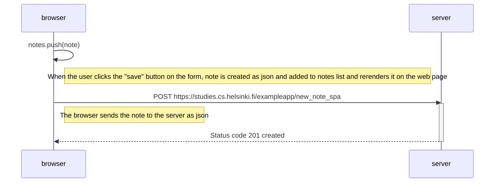

# 0.6: Uusi muistiinpano

```mermaid
sequenceDiagram

    participant browser
    participant server

    browser->>browser: notes.push(note)

    Note right of browser: When the user clicks the "save" button on the form, note is created as json and added to notes list and rerenders it on the web page

    browser->>server: POST https://studies.cs.helsinki.fi/exampleapp/new_note_spa
    activate server

    Note right of browser: The browser sends the note to the server as json

    server-->>browser: Status code 201 created

    deactivate server
```    